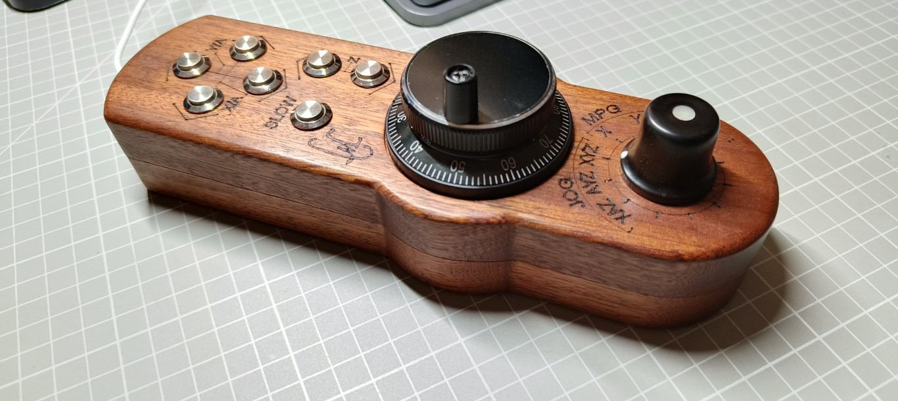
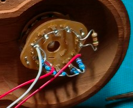
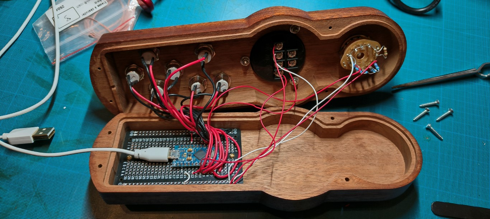

# CNC Pendant for Mach3 / SimCNC / any CNC controler software that accepts keyboard shortcuts

## Implementation :
- Arduino pro micro / USB connected
- 7 x push buttons
- 1 x rotary encoder wheel
- 1 x 12 positions mechanical selector. (7 positions used)

## Rotary selector:
In order to save digital I/O pins on the arduino, the rotary selector output is an analog signal and
is connected to Analog inpit 0
Selector Wirering:

| Pin | Connection | measured value | Function |
| ---- | ----------- |  ----------- | ----------- |
| Common | A0 analog input | 0<1023 |  |
|Pin 1 | GND | 0 | NOP |
|Pin 1 | 4.7 KOhm resistor to Pin 2 | 0 | NOP |
|Pin 2 | 4.7 KOhm resistor to Pin 3 | 144 | JOG_XAZ |
|Pin 3 | 4.7 KOhm resistor to Pin 4 | 290 | JOG_AYZ |
|Pin 4 | 4.7 KOhm resistor to Pin 5 | 436 | JOG_XYZ |
|Pin 5 | 4.7 KOhm resistor to Pin 6 | 583 | MPG_X |
|Pin 6 | 4.7 KOhm resistor to Pin 7 | 729 | MPG_Y |
|Pin 7 | 4.7 KOhm resistor to Pin 8 | 876 | MPG_Z |
|Pin 8 | 5V | 1023 | MPG_A |
|Pin 8 < Pin 12 | GND | 0 | NOP |

## Encoder Wheel
example of the model I have used :
https://www.amazon.com/100PPR-Driver-Output-Wheel-Encoder/dp/B01EA9I5LW

| Pin | Connection | 
| ---- | ----------- | 
| 0V  | GND | 
| Vcc | 5V |
| A | Digital in 2 | 
| B | Digital in 3 |

## Push Buttons
| Pin | Connection |
| ---- | ----------- |
| Commons | GND |
| UP_BUTTON | Digital in 4 |
| DOWN_BUTTON | Digital in 5 |
| LEFT_BUTTON | Digital in 6 |
| RIGHT_BUTTON | Digital in 7 |
| Z_UP | Digital in 8 |
| Z_DOWN | Digital in 9 |
| SLOW_BUTTON | Digital in 16 |

# Usage

## JOG Mode
* XYZ : you can jog the three X, Y and Z axis
* AYZ : used with 4th axis, when A is along Y axis : The left and right arrows are used for A instead of X
* XAZ : used with 4th axis, when A is along X axis : The up and down arrows are used for A instead of Y
* Default spead is Fast Jog
* Holding the Slow button + other move button : Slow jog

| Selector position | Buttons | Function | SLOW button | Keyboard shortcut sent |
| ---- | ----------- |  ----------- | ----------- | ----------- |
| JOG_XYZ| LEFT / RIGHT | X axis - / X axis + |  | Shift+left arrow / Shift+right arrow |
| JOG_XYZ| UP / DOWN | Y axis + / Y axis - |  | Shift+up arrow / Shift+down arrow |
| JOG_XYZ| ZUP / ZDOWN | Z axis + / Z axis -|  | Shift+PgUp / Shift+PgDown |
| JOG_XYZ| same | same | SLOW | same without Shift |
|  |   |   |   |   |
| JOG_XAZ| LEFT / RIGHT | X axis - / X axis + |  | Shift+left arrow / Shift+right arrow |
| JOG_XAZ| UP / DOWN | A axis + / A axis - |  | Shift+Home / Shift+End |
| JOG_XAZ| ZUP / ZDOWN | Z axis + / Z axis -|  | Shift+PgUp / Shift+PgDown |
| JOG_XAZ| same | same | SLOW | same without Shift |
|  |   |   |   |   |
| JOG_AYZ| LEFT / RIGHT | A axis + / A axis - |  | Shift+Home / Shift+End |
| JOG_AYZ| UP / DOWN | Y axis + / Y axis - |  | Shift+up arrow / Shift+down arrow |
| JOG_AYZ| ZUP / ZDOWN | Z axis + / Z axis -|  | Shift+PgUp / Shift+PgDown |
| JOG_AYZ| same | same | SLOW | same without Shift |

## MPG Mode
* Use the MPG encoder wheel for fine adjustments on a single axis

| Selector position | Moves | Function | Keyboard shortcut sent |
| ---- | ----------- |  ----------- | ----------- |
| MPG X| Wheel CW/ACW | X axis + / X axis - | Ctrl+right arrow / Ctrl+left arrow |
| MPG Y| Wheel CW/ACW | Y axis + / Y axis - | Ctrl+up arrow / Ctrl+down arrow |
| MPG Z| Wheel CW/ACW | Z axis + / Z axis - | Ctrl+PgUp / Ctrl+PgDown |
| MPG A| Wheel CW/ACW | A axis + / A axis - | Ctrl+Home / Ctrl+End |

# Build / Upload

I personnaly use Visual Studio Code + Platform IO extension to work with Arduino boards.

# More Info

This tool was published to the online tool Encyclopedia homematetools.net :
See :
https://www.homemadetools.net/forum/cnc-pendant-101174